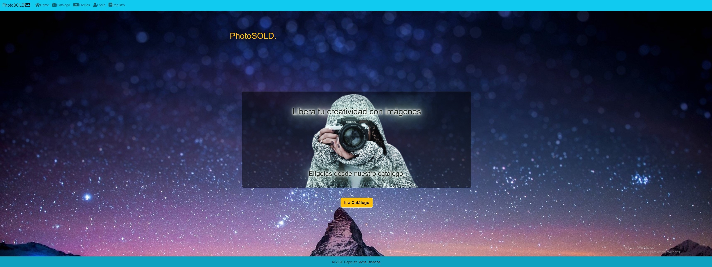
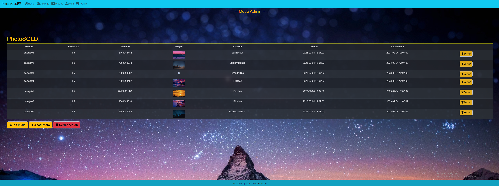

#..................................>>>photoSold.<<<....................................

# Breve introducción al proyecto de la APP
Este es un primer proyecto usado como actividad del ciclo superior de desarrollo web,para familiarizarse con las tecnologías que se usan en el despliegue de aplicaciones.

No es una página web profesional, sino un ejercicio de prácticas del alumnado.

Más adelante irá sufriendo cambios a medida que se vayan corrigiendo errores e implementando nuevas herramientas o añadiendo funcionalidades al proyecto.

# ¿Qué es photoSold.?
Es un proyecyo web destinado a la compra de imágenes y fotografías. En el podremos editar,añadir, borrar y ver dichas imágenes dependiendo de si somos el administrador de la web, un usuario o un visitante (CRUD). 

# Página principal (HOME)



# Instalación de la App
1. Primero, debemos clonar el repositorio; desde una terminal servirá:
```
git clone https://github.com/achemiranda/photoSOld.git
```

2. Segundo, creamos la base de datos, el archivo  está en la ruta:
```
data/BBDD.sql
```
Se puede instalar por medio del xampp, activando el mysql, entrar en una terminal,teclear 'mysql -u root' y copiar y pegar uno a uno los datos de la BBDD.sql.

3. Tercero, creamos el archivo '.env' que nos debe de crear las variables de entorno para la conexión con la base de datos ya creada :
```
DB_HOST = localhost
DB_USER = root
DB_PASS = 
DB_NAME = photoSold
```

4. Cuatro,  instalamos composer desde la terminal en visual code:
```
composer install
composer update
```

Tras esto comando se genera un archivo composer.lock

5. Cinco, activamos Apache y Mysql en Xampp, y escribimos desde el root el comando:
```
php -S localhost:8000
```

6. Por último, ejecutamos en cualquier navegador la ruta:
```
http://localhost:8000
```
# Uso de la aplicación photoSold:
## Usuario sin cuenta
El usuario sin cuenta o que no use su login solo verá las páginas como visitante, si quiere poder comprar ,necesitará tener una cuenta y entrar como usuario. 

## Usuario registrado
1. Para poder comprar, si no es aún usuario, debe acceder a la página de registro, ir al menú, rellenar los datos, pulsar el botón de 'Registrarse', en caso de que ya tenga cuenta,acceder al mismo desde login introducir dlos datos y ahí entrar.

2. Una vez hecho esto, podrá comprar las fotos disponibles en catálogo,eliminar su perfil,o bien cerrar sesión mediante botones .

3. Para **eliminar su usuario** tendría que ir al botón 'dar de baja' para los usarios, una vez dentro se verá un formulario con datos a rellenar de su usuario y un botón que pone 'Eliminar', si le da a ese botón y los datos coinciden con los del perfil, se podrá eliminar dicho perfil y la web lo volverá a llevar la página de Inicio.




## Administrador
1. El administrador podrá ver todas las fotografías, borrarlas,añadir nuevas, y ver y eliminar usuarios(más adelante, aún no está implementado).

2. Para **eliminar fotos** tiene que estar en la página de catálogo, una vez ahí, si existen fotos disponibles se podrá ver a la derecha un botón que pone 'Borrar', donde al pulsarlo se elimina la foto.

4. Para **añadir fotos** tendremos que ir al menú, al botón catálogo y ahí pulsar el botón de 'Añadir foto', una vez dentro se verá una formulario para rellenar los datos la imagen a añadir y abajo un botón que pone 'Añadir', simplemente haciendo click a ese botón ya se está añaden los datos de la foto la cual hemos luego de añadir a la carpeta 'images',
en el campo del formulario, en la casilla imagen introducimos la ruta hacia la carpeta 
**../PUBLIC/images/ + 'nombre imagen.jpg'**.

# Autor:
Ache Miranda Abadín
# Tecnologías
Para el proyecto, se ha usado:

* Visual Studio Code.
* HTML5.
* CSS3.
* Bootstrap v4.
* PHP.
* Doxygen.
* MarkDown.

Se ha desplegado con:

* Heroku.

# Documentación
[Documentacion con Doxygen](https://photosold.herokuapp.com/DOCS/html/index.html) 